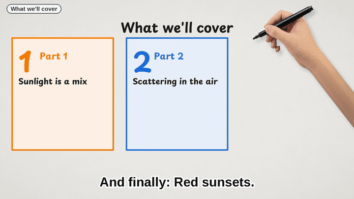

# Doodle Studio

**Turn any script into a hand-drawn whiteboard explainer video, on your own computer.**

Paste a script and Doodle Studio produces a finished MP4. A drawing hand sketches cartoon doodles, handwritten notes and small charts while a natural voice narrates. Captions, chapters, music, a thumbnail and a transcript come with it. English and Chinese (中文) are both first-class.



- **Works offline and for free.** Voice, drawing and video are all made locally. No account and no API key needed.
- **1,760+ doodles.** It ships 279 original drawings in one bold outlined style (plus a recurring narrator character) and 1,483 Microsoft Fluent Emoji redrawn to match.
- **It explains, not just decorates.** Numbers become big stats and 100-square grids, dates become timelines, "X is called Y" becomes a sticky-note definition, and quotes become quote cards. Every section ends with a takeaway note that pins onto the agenda.
- **Everything is editable.** Swap any doodle, fix a label, retitle a section, preview a frame, then make the video.
- **Optional AI director.** It can plan the visuals with GPT-6 Luna or Claude: through Doodle Cloud (free plan, no key needed), or with your own OpenAI, Anthropic or OpenAI-compatible key.

## Install

**App:** download *Doodle Studio* for macOS, Windows or Linux from [Releases](../../releases) and open it. The first video downloads the voice model (about 190 MB per language, checksum-verified).

The app isn't signed with a developer certificate yet, so the first launch needs one approval:
- **macOS:** unzip, drag *Doodle Studio* to Applications and open it. When macOS blocks it, go to System Settings → Privacy & Security and click **Open Anyway**. If macOS says the app is damaged, run `xattr -dr com.apple.quarantine "/Applications/Doodle Studio.app"` once.
- **Windows:** unzip and run *Doodle Studio.exe*. If SmartScreen appears, click **More info** → **Run anyway**.

**Command line** (Python 3.10–3.12):

```bash
uv tool install git+https://github.com/edwardaiwang-svg/doodle-studio     # or: pipx install git+https://…
doodle studio                                                    # opens the app window
doodle make my-script.md -o "My Video"                           # or straight to an MP4
```

## Write a script

Plain text, Markdown or a .docx file works.

- `#` gives the title; each `##` heading becomes a section with its own agenda card. With no headings, the text is split for you.
- Write the way you would speak it. Numbers are read out properly ("$3.8bn", "1450s" and "30%" all work, and so do "2026年" and "百分之三十").
- A final "Conclusion" or "总结" section becomes the ending.

## Directors: who plans the visuals

| Director | Cost | Notes |
|---|---|---|
| **Offline** (default) | free | Matches the words of each sentence to the doodle library on your computer. Nothing leaves your machine. |
| **Doodle Cloud** | free: 5 videos a month | GPT-6 Luna plans each section. No key needed; sign in with an email code. Paid plans: $5/month for GPT-6 Luna with no video count (fair use); $20/month adds Claude Opus 5.5 (10 videos a month). |
| **Your OpenAI key** (Advanced) | about $0.02 per 15-min video | Default `gpt-6-luna`. In the app, turn on Settings → Advanced directors to see these last four options. |
| **Your Anthropic key** | about $1 per 15-min video | `claude-opus-5`, `claude-opus-5-5`, or the cheaper `claude-haiku-4-5`. |
| **OpenAI-compatible** | varies | OpenRouter, DeepInfra, Groq, or a local Ollama or LM Studio. |
| **Your own command** | varies | Any program you choose: it gets each request as JSON and prints the plan as JSON. |

AI answers are always checked by code before use:
- doodles must come from the library;
- drawing triggers must be words that are actually spoken;
- numbers, dates and quotes must appear in your script.

Any beat that fails keeps the offline plan. Keys are stored in your system keychain.

## How it works

```
script ─▶ ingest ─▶ beats + spoken text ─▶ director ─▶ storyboard.json ─▶ Kokoro voice ─▶ timeline ─▶ renderer ─▶ mix + package
          (md/docx)  ("$3.8bn" → "three point    (rules or LLM)  (editable)     (per-phoneme    (captions,   (hand-drawn     (music, chapters,
                     eight billion dollars")                                    timing)          music)       frames)         QA, thumbnail)
```

- **Voice:** [Kokoro](https://huggingface.co/hexgrad/Kokoro-82M) through [kokoro-onnx](https://github.com/thewh1teagle/kokoro-onnx), on the CPU. Its per-phoneme timing lines drawings and captions up with the words (typically within 0.2 s).
- **Drawing:** SVG outlines are traced in drawing order by a photographed hand, then the colour pops in. Text is written stroke by stroke from the font's glyph skeletons.
- **Quality checks:** every video is fully decoded and its frame count checked. Its audio is compared with the mix, and its chapters are verified.

See [docs/architecture.md](docs/architecture.md) and [the storyboard format](docs/storyboard.md).

## Limits

- The offline director draws a word only in the sense its section is about, and leaves the word undrawn when it can't tell (a wine-making "press" is never drawn as a newspaper). It can't read between the lines the way an AI director can; swap any doodle in the editor, or use an AI director.
- Rendering takes about as long as the video (a 15-minute video takes about 10–15 minutes on a recent laptop). `--workers` uses more cores.
- Only English and Chinese are supported so far. Full manual testing was done on macOS; Windows and Linux are covered by CI.

## Privacy

Offline mode sends nothing anywhere. With Doodle Cloud or your own key, only the text of one section at a time (plus doodle names) goes to the AI provider. Doodle Cloud does not store script text.

## Licences

- **Code:** MIT ([LICENSE](LICENSE)).
- **Original doodles, narrator and drawing hand:** CC BY 4.0.
- **Everything else** (fonts, emoji, music, voice model, libraries) keeps its own licence; see [THIRD_PARTY_NOTICES.md](THIRD_PARTY_NOTICES.md).
- **Your videos are yours.** No attribution is required, though "Made with Doodle Studio" is appreciated.
